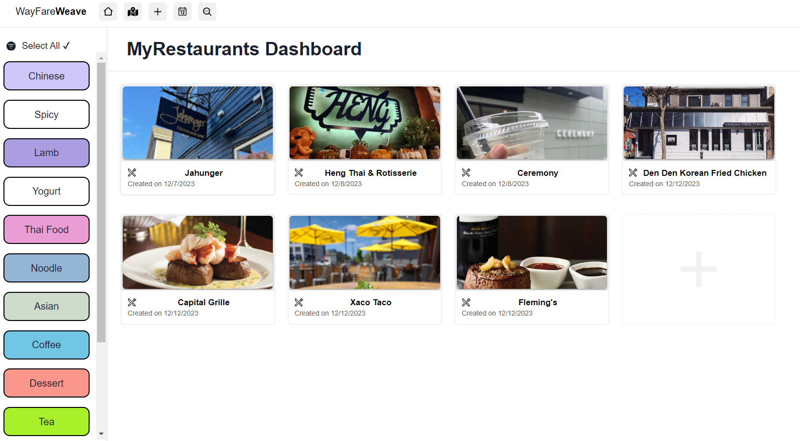
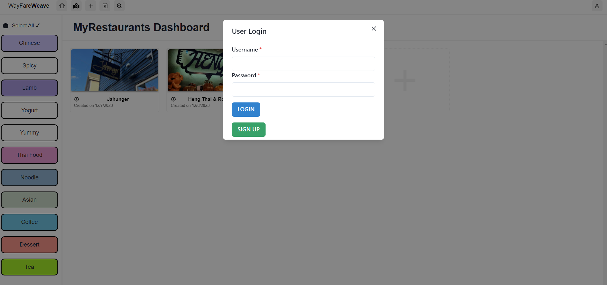
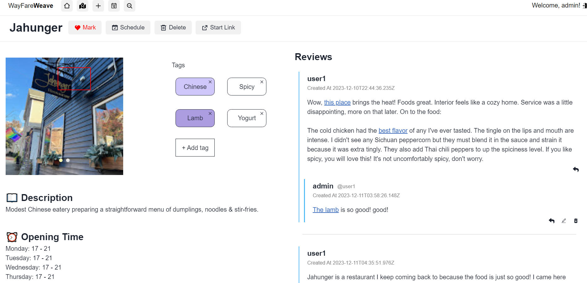
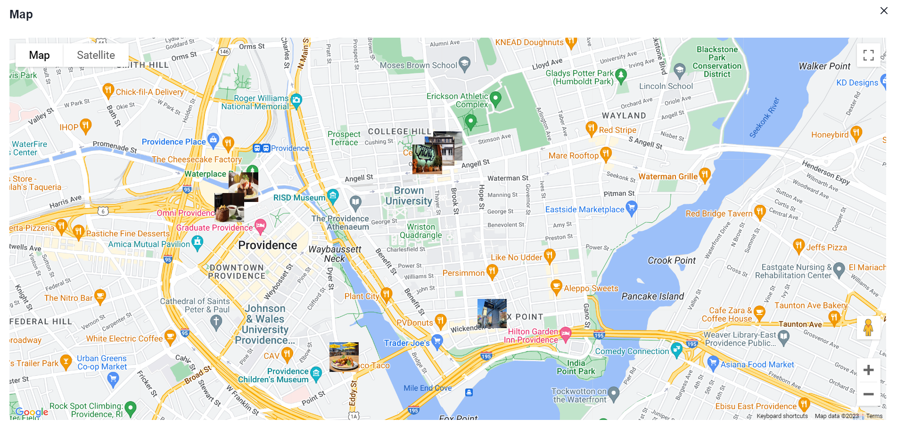
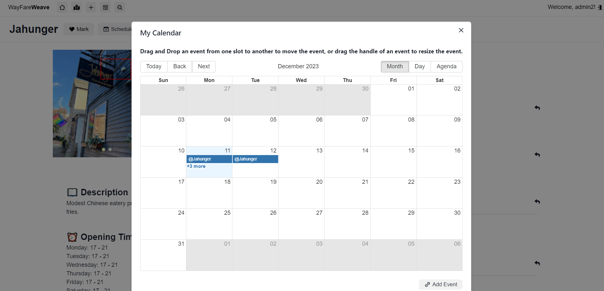
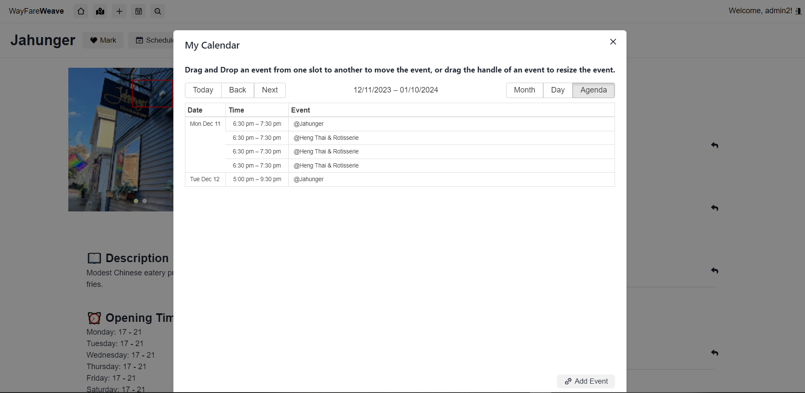
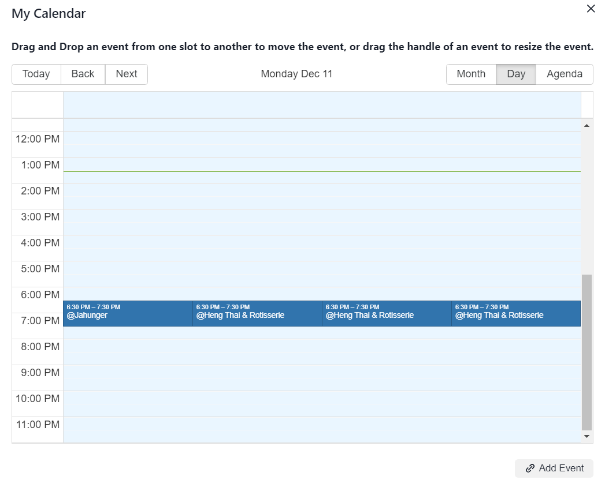
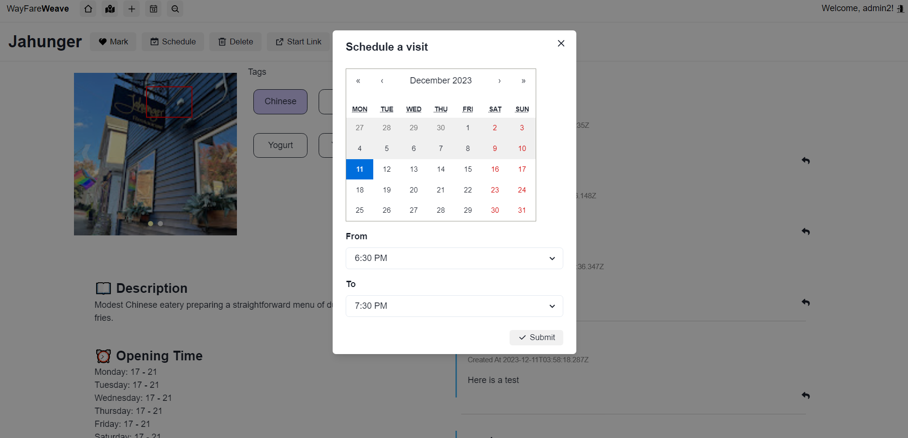
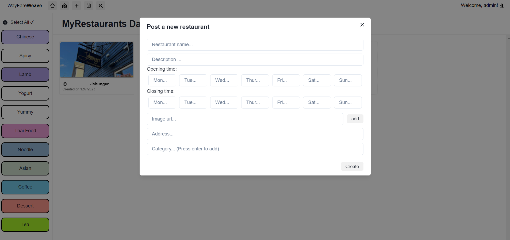
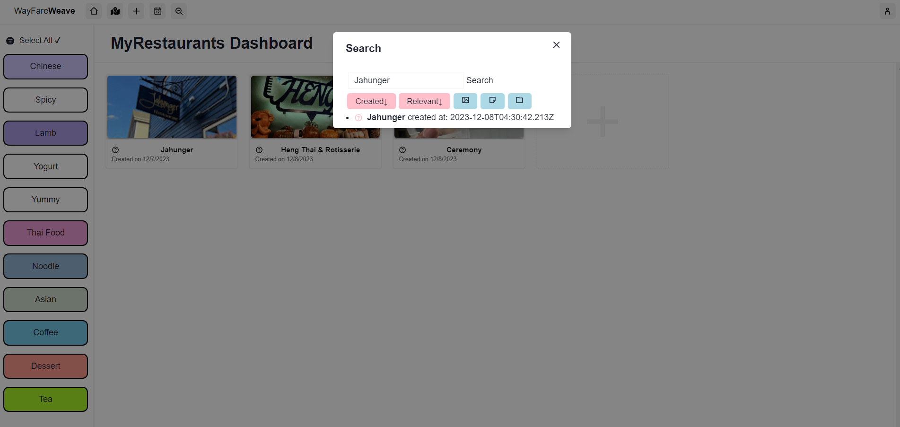

# Wayfare Weave

## Table of Contents

1. [Description](#description)

2. [Usage](#usage)

3. [Demo](#demo)

4. [Future Improvement](#future-improvement)

## Description

Wayfare Weave is a project that aims to provide users with a map-based dining planning platform that enables them to explore and share their favorite restaurants and culinary experiences. We implemented restaurant nodes, theme planning features, comment features, map features, calendar scheduling and user authentication features.

## Usage

### Run locally

1. Open the terminal, cd to the server and start server

```

cd server

npm install

npm run dev

```

The server will start at `localhost:8000`. And if successful, it will show `MyHypermedia Backend Service`

2. Start client

```

cd client

npm install

npm run dev

```

The client will start at `localhost:3000`

## Demo

- Main page
  

- Log in
  

- Restaurant node View
  

- Clickable Map View
  

- Calendar View
  
  
  

- Schedule
  

- Add Restaurant
  

- Search
  

#### Map API

We use `Google Places API`, `Google Geocoding API`, and `Maps API`. The AutoCompleteService runs in the background periodically fetch the predictions about the input from the restaurant creator. When creating the restaurant, the Geocoding API fetch the latitude/longtitude and store the corresponding latitute/longtitude in the database. The Maps API support the map view and the marker. We feel we have a better understanding of useRef now. Another valuable lesson we have learnt is not to rely too much on third-party packages, even though they do simplify the use of the original API and provide a more user-friendly interface. We should have spent less time on this part if we directly chose the original API. We invested considerable time debugging a issue, only to find it was caused by dependencies of two packages are incompatiable

Our `CreateNode` function support autocomplete feature, just like Google Maps. So if the user enters a address with the restaurant name, for example, Jahunger, when they type in "Jahun", the matched result will be shown in the drop-down menu, and they can simply click it to select the location for the restaurant.

#### Calendar

We use `react-calendar` for scheduling a visit, and `react-big-calendar` to help users view their schedules. Users can drag and drop scheduled events to suit their convenience or click/select an event to delete it. The challenging aspect is about Chakra UI, which seems to have its own z-index settings. This causes issues where dropdown menus are getting hidden. Finally we decides to navigate users to the day view by clicking showing more.

### Future Improvement

If we have more time, we would:

- Redesign the UI to make it more organized and creative

- Restaurant sharing function; notification and messages

- Error checking of user input

- Community Features
- Mark Restaurants(finish the mark filtering)

- Fuzzy search implementation


